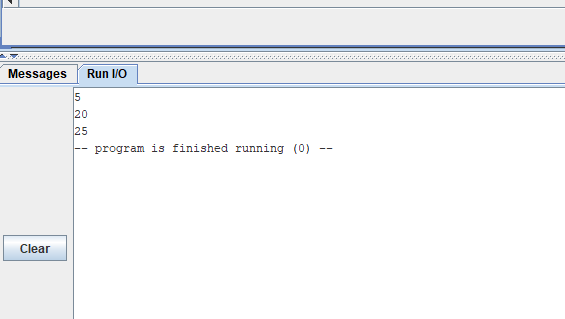
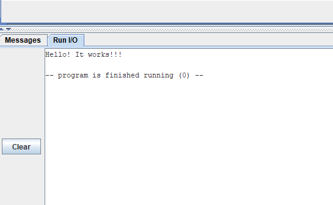
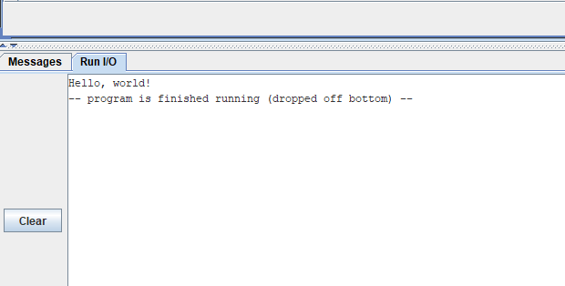
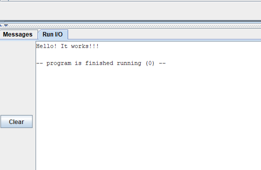
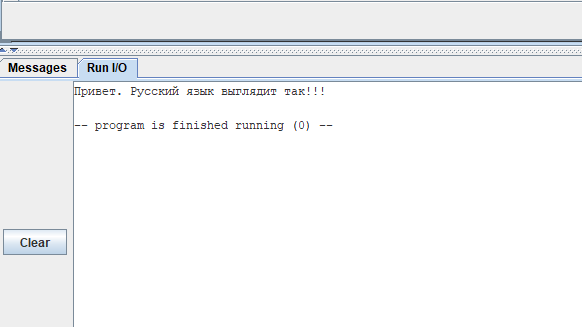
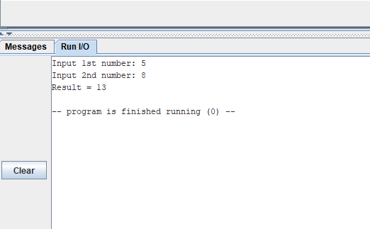

# Евсюков Александр БПИ224 Домашняя работа №1

## Программа 1
Код программы:
```
        li      a7 5        # Системный вызов №5 — ввести десятичное число
        ecall               # Результат — в регистре a0
        mv      t0 a0       # Сохраняем результат в t0
        ecall               # Регистр a7 не менялся, тот же системный вызов
        add     a0 t0 a0    # Прибавляем ко второму число первое
        li      a7 1        # Системный вызов №1 — вывести десятичное число
        ecall
        li      a7 10       # Системный вызов №10 — останов программы
        ecall
```
Результат работы программы: 




## Программа 2
Код программы:
```
.text
        la a0, string       # buffer
        li a7, 4            # syscall write (4)
        ecall
        li a0, 0            # exit code
        li a7, 10           # syscall exit
        ecall
.data
    string:  .asciz "Hello! It works!!!\n"
```
Результат работы программы: 




## Программа 3
Код программы:
```
    .data
hello:
    .asciz "Hello, world!"
    .text
main:
    li a7, 4
    la a0, hello
    ecall
```
Результат работы программы: 




## Программа 4
Код программы:
```
.text
        la a0, string       # buffer
        li a7, 4            # syscall write (4)
.data
    string:  .asciz "Hello! It works!!!\n"
.text
        ecall
        li a0, 0            # exit code
        li a7, 10           # syscall exit
        ecall
```
Результат работы программы: 




## Программа 5
Код программы:
```
.text
        la a0, string       # buffer
        li a7, 4            # syscall write (4)
        ecall
        li a0, 0            # exit code
        li a7, 10           # syscall exit
        ecall
.data
    string:  .asciz "Привет. Русский язык выглядит так!!!\n"
```
Результат работы программы: 




## Программа 6
Код программы:
```
.data
    arg01:  .asciz "Input 1st number: "
    arg02:  .asciz "Input 2nd number: "
    result: .asciz "Result = "
    ln:     .asciz "\n"
.text
        la 	a0, arg01   # Подсказка для ввода первого числа
        li 	a7, 4       # Системный вызов №4
        ecall
        li      a7 5        # Системный вызов №5 — ввести десятичное число
        ecall               # Результат — в регистре a0
        mv      t0 a0       # Сохраняем результат в t0

        la 	a0, arg02   # Подсказка для ввода второго числа
        li 	a7, 4       # Системный вызов №4
        ecall
        li      a7 5        # Системный вызов №5 — ввести десятичное число
        ecall               # Результат — в регистре a0
        mv      t1 a0       # Сохраняем результат в t1

        la a0, result       # Подсказка для выводимого результата
        li a7, 4            # Системный вызов №4
        ecall
        add     a0 t0 t1    # Складываем два числа
        li      a7 1        # Системный вызов №1 — вывести десятичное число
        ecall

        la a0, ln           # Перевод строки
        li a7, 4            # Системный вызов №4
        ecall

        li      a7 10       # Системный вызов №10 — останов программы
        ecall
```
Результат работы программы: 



## Отчёт
Проведем анализ последней программы для составления отчета: 
* Псевдокоманды:
    * `li a7, 4` , `li a7 5` - псевдокоманды, так как мы напрямую не помещаем значение в регистр, а складываем его с 0
    * директива `.data` и вложенные в нее строки `arg01` , `arg02` , `result` и `ln` тоже являются псевдокомандами, так как не дают команду машине, это строки, которые мы используем для вывода и ввода
    * `mv      t0 a0` - псевдокоманда, так как в ее основе лежит Move, но в нашем случае она сохраняет значение в регистр и это реализовывается через add с добавлением 0

* типы форматов команд: 
    1. R-формат:
        * `add a0 t0 t1` - сложение друх чисел из регистра t0 и t1, сохранение результата в a0
    2. I-формат:
        * `li a7, 4` и `li a7 5` - загрузка значения в регистр a7
        * `mv t1 a0` и  `mv t1 a0`- сохранение результатов в регистр a0
    3. U-формат:
        * `la a0, arg01`, `la a0, arg02`, `la a0, result`, и `la a0, ln` - загрузка строк из директивы в регистр a0

* Системные вызовы: 
    * `Системный вызов №1` - вывод числа типа int
    * `Системный вызов №4` - вывод строки в консоль
    * `Системный вызов №5` - ввод данных типа int из консоли
    * `Системный вызов №10` - останов программы 

## Опциональное задание
[](https://www.youtube.com/watch?v=yiHnwdd5xB4)
