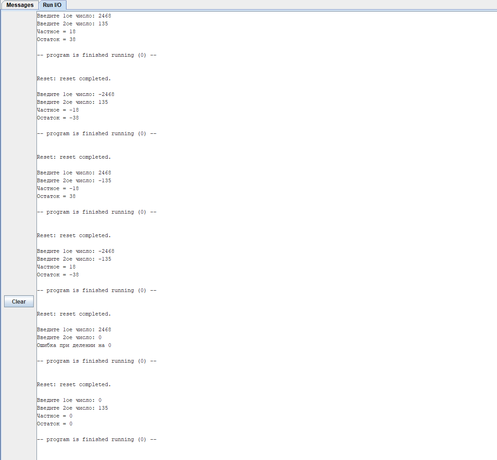

# Евсюков Александр БПИ224 Домашняя работа №2

### Код программы:

``` Assembly
.data
	arg01:  .asciz "Введите 1ое число: "
    	arg02:  .asciz "Введите 2ое число: "
    	result1: .asciz "Частное = "
    	result2: .asciz "Остаток = "
    	ln:     .asciz "\n"
    	zero_error: .asciz "Ошибка при делении на 0"
.text
        la 	a0, arg01       # Подсказка для ввода первого числа
        li 	a7, 4           # Системный вызов №4
        ecall
        li      a7 5        	# Системный вызов №5 — ввести десятичное число
        ecall              	# Результат — в регистре a0
        mv      t1 a0       	# Сохраняем результат в t0

        la 	a0, arg02       # Подсказка для ввода второго числа
        li 	a7, 4           # Системный вызов №4
        ecall
        li      a7 5        	# Системный вызов №5 — ввести десятичное число
        ecall               	# Результат — в регистре a0
        mv      t2 a0       	# Сохраняем результат в t1
        
        beqz 	t2, error   	# Обработка ошибки деления на 0
        
	bltz 	t1, neg_t1      # if t1 < 0, меняем знак на противоположный и сохраняем текущий
back1:
	bltz 	t2, neg_t2      # if t2 < 0, меняем знак на противоположный и сохраняем текущий	
		    
while:	blt 	t1, t2, end_while   # if t1 < t2, заканчиваем цикл
	sub 	t1, t1, t2          # От t1 отнимаем t2 и сохраняем t1
	addi 	t0, t0, 1           # В t0 сохраняем целую часть 
	j    	while               # Возвращаемся в начало цикла
end_while:
	
	bltz	t3, neg_sign1       # if t3 < 0, меняем знак у целой части
back2:	
	bltz	t4, neg_sign2       # if t4 < 0, меняем знак у остатка
back3:

        la 	a0, result1	    # Подсказка для выводимого результата
        li 	a7, 4       	    # Системный вызов №4
        ecall
        mv     a0 t0    	    # Перенос значения из t0 в a0 для вывода
        li      a7 1                # Системный вызов №1 — вывести десятичное число
        ecall
	
	la 	a0, ln       	    # Перевод строки
        li 	a7, 4               # Системный вызов №4
        ecall
	
	la 	a0, result2         # Подсказка для выводимого результата
        li 	a7, 4               # Системный вызов №4
        ecall
        mv     a0 t1    	    # Перенос значения из t1 в a0 для вывода
        li      a7 1                # Системный вызов №1 — вывести десятичное число
        ecall
	
        la 	a0, ln              # Перевод строки
        li 	a7, 4               # Системный вызов №4
        ecall
        j 	exit
        
error:	la 	a0, zero_error      # Вывод информации об ошибке
        li 	a7, 4               # Системный вызов №4
        ecall
        
        la 	a0, ln              # Перевод строки
        li 	a7, 4               # Системный вызов №4
        ecall
        
exit:   li      a7 10               # Системный вызов №10 — останов программы
       	ecall

neg_t1: neg 	t1, t1	            # Меняем знак у t1
	addi 	t3, t3, -1	    # Отнимаем от t3 -1, чтобы сохранить знак целой части
	addi 	t4, t4, -1	    # Отнимаем от t4 -1, чтобы сохранить знак остатка
	j 	back1		    # Возвращаемся к основному коду
	
neg_t2: neg 	t2, t2		    # Меняем знак у t2
	bltz 	t3, sign2	    # if t3 < 0, то меняем знак у целой части, так как - на - равно +
	beqz 	t3, sign1	    # if t3 == 0, сохраняем минус для целой части
	j 	while		    # Возвращаемся к основному коду
	
sign1:	addi 	t3, t3, -1 	    # Отнимаем от t3 -1, чтобы сохранить знак целой части
	j 	back1		    # Возвращаемся к основному коду

sign2: 	neg 	t3, t3		    # меняем знак у целой части, так как - на - равно +
	j	back1		    # Возвращаемся к основному коду
	
neg_sign1:
	neg 	t0, t0		    # Меняем знак для целой части
	j	back2		    # Возвращаемся к основному коду

neg_sign2:
	neg 	t1, t1		    # Меняем знак для остатка
	j	back3 		    # Возвращаемся к основному коду
```

### Пример работы:

