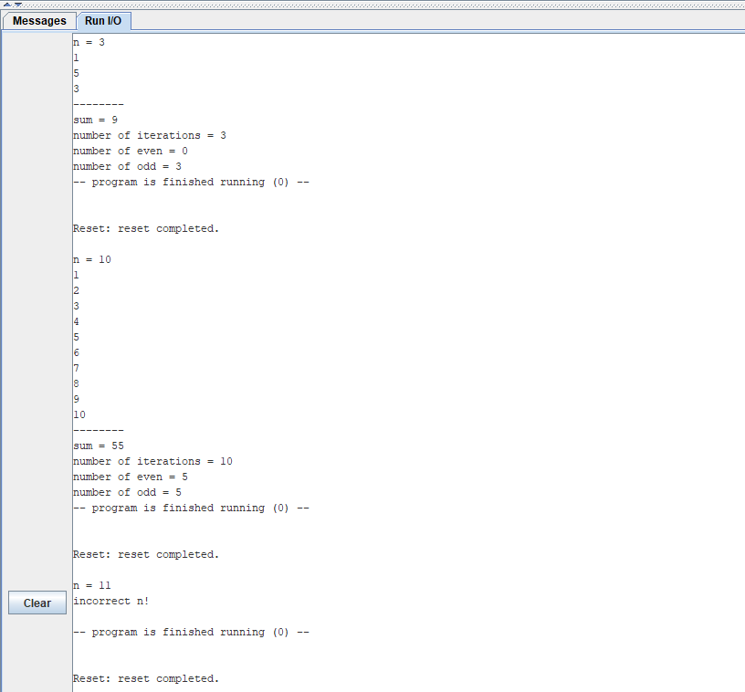

# Евсюков Александр БПИ224 Домашняя работа №3

### Код программы:
```
.data
        sep:            .asciz  "--------\n"                    # Строка-разделитель (с \n и нулём в конце)
        line_break:     .asciz 	"\n"                            # Перенос строки
        prompt:         .asciz  "n = "                          # Подсказка для ввода числа
        error1:         .asciz  "incorrect n!\n"                # Сообщение о некорректном вводе
        error2:         .asciz 	"overflow!"                     # Сообщение о переполнении
        result1:        .asciz 	"sum = "                        # Подсказка для вывода 1 
        result2:        .asciz 	"number of iterations = "       # Подсказка для вывода 2 
        result3:        .asciz 	"number of even = "             # Подсказка для вывода 3 
        result4:        .asciz 	"number of odd = "              # Подсказка для вывода 4
	
        .align  2                                               # Выравнивание на границу слова
        n:              .word	0                               # Число введенных элементов массива
        array:          .space  64                              # 64 байта
.text
in:
        la      a0, prompt      # Подсказка для ввода числа элементов массива
        li      a7, 4           # Системный вызов №4
        ecall
        li      a7 5            # Системный вызов №5 — ввести десятичное число
        ecall
        mv      t3 a0           # Сохраняем результат в t3 (это n)
        ble     t3 zero fail    # На ошибку, если меньше 0
        li      t4 10           # Размер массива
        bgt     t3 t4 fail      # На ошибку, если больше 10
        la      t4 n            # Адрес n в t4
        sw      t3 (t4)	        # Загрузка n в память на хранение          

        la      t0 array        # Указатель элемента массива     
input:	li      a7 5            # Системный вызов №5 — ввести десятичное число
        ecall
        mv      t2 a0           # Сохраняем результат в t2	        
        sw      t2 (t0)         # Запись числа по адресу в t0
        addi    t0 t0 4         # Увеличим адрес на размер слова в байтах
        addi    t3 t3 -1        # Уменьшим количество оставшихся элементов на 1
        bnez    t3 input        # Если осталось больше 0
        la      a0 sep          # Выведем строку-разделитель
        li      a7 4            # Системный вызов №4
        ecall

        lw      t3 n                # Число элементов массива
        la      t0 array            # Указатель элемента массива
        li      t2, 0               # Обнуление 0    
        li      s3, 2               # s3 = 2
solve: 	lw      t5 (t0)        	    # Вытаскиваем элемент массива и кладем его в t5
        bgtz    s7, even_odd        # Если у нас произошло переполнение, то переменная больше 0 и мы не считаем сумму    
        add 	t2 t2 t5            # Складываем t5, t6 и сохраняем в t2			
	
        bltz 	t5 check1           # if t5 < 0
back1:	bgtz	t5 check2           # if t5 > 0
back2:	
        mv      t6 t2               # Сохраняем сумму в t6    
        addi    s1 s1 1	            # Количество итераций
	
even_odd:
        remu    s4 t5 s3            # Вычисление остатка при деления на 2
    	beqz    s4 even             # if s4 == 0, то число четное
    	bnez    s4, odd             # if s4 != 0, то число нечетное
back3:                              # Сохраняем сумму в t6
        addi    t0 t0 4             # Увеличим адрес на размер слова в байтах
        addi    t3 t3 -1            # Уменьшим количество оставшихся элементов на 1    	
        bnez    t3 solve            # Если осталось больше 0
        
out:	la      a0 result1          # Подсказка для выводимого результата
        li      a7 4                # Системный вызов №4
        ecall
        mv     	a0 t6               # Перенос значения из t6 в a0 для вывода
        li      a7 1                # Системный вызов №1 — вывести десятичное число
        ecall
        
        la      a0 line_break	    # Перенос строки
        li      a7 4                # Системный вызов №4
        ecall
        
        la      a0 result2          # Подсказка для выводимого результата
        li  	a7 4                # Системный вызов №4
        ecall
        mv      a0 s1               # Перенос значения из t4 в a0 для вывода
        li      a7 1                # Системный вызов №1 — вывести десятичное число
        ecall
        
        la      a0 line_break	    # Перенос строки
        li      a7 4                # Системный вызов №4
        ecall
        
        la      a0 result3          # Подсказка для выводимого результата
        li  	a7 4                # Системный вызов №4
        ecall
        mv      a0 s5               # Перенос значения из s5 в a0 для вывода количества четных
        li      a7 1                # Системный вызов №1 — вывести десятичное число
        ecall
        
        la      a0 line_break	    # Перенос строки
        li      a7 4                # Системный вызов №4
        ecall
        
        la      a0 result4          # Подсказка для выводимого результата
        li  	a7 4                # Системный вызов №4
        ecall
        mv      a0 s6               # Перенос значения из s6 в a0 для вывода количества нечетных
        li      a7 1                # Системный вызов №1 — вывести десятичное число
        ecall
        
        
exit:   li      a7 10               # Останов
        ecall
        
check1: bgtz 	t6 back1     		# if t6 > 0
        bgt 	t2 t6 out_error		# if t2 > t6
        j       back1   
	
check2: bltz 	t6 back2     		# if t6 < 0
        blt 	t2 t6 out_error		# if t2 < t6
        j       back2

out_error:    
        la      a0 error2               # Сообщение об ошибке
        li      a7 4                    # Системный вызов №4
        ecall	
        la      a0 line_break           # Перенос строки
        li      a7 4                    # Системный вызов №4
        ecall
        addi    s7 s7 1                 # Увеличиваем s7
        j       solve	         

even:	addi	s5  s5 1		# Увеличиваем счетчик четного
        j       back3
odd:	addi 	s6  s6 1		# Увеличиваем счетчик нечетного
        j       back3	         	         	         
	         	         	         	         	         	         	         	         	         
fail:
        la 	    a0, error1          # Сообщение об ошибке ввода числа элементов массива
        li 	    a7, 4               # Системный вызов №4
        ecall
        j	    exit
```

### Пример работы:


