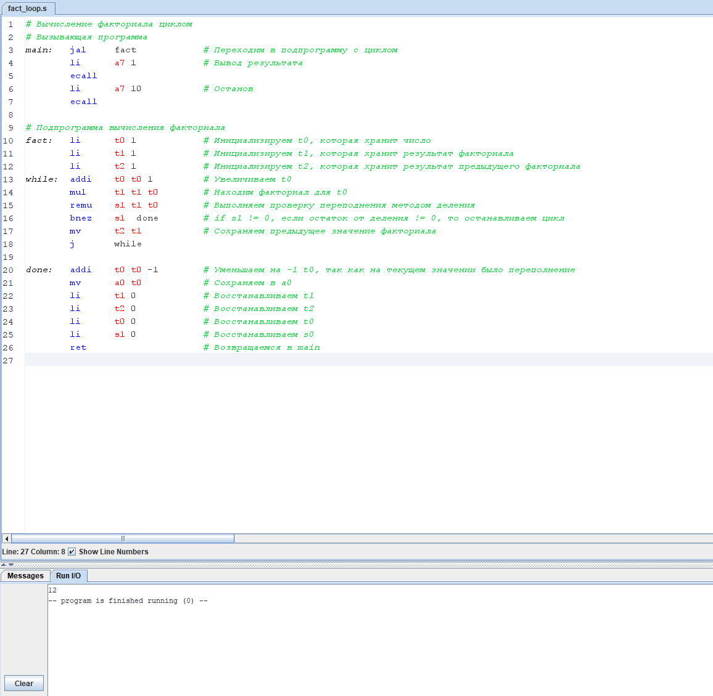

# Евсюков Александр БПИ224 <br/> Домашняя работа №4

## 1. Поиск факториала через цикл
### _Код программы_:
```
# Вычисление факториала циклом
# Вызывающая программа
main:   jal     fact            # Переходим в подпрограмму с циклом
        li      a7 1            # Вывод результата
        ecall                   
        li      a7 10           # Останов
        ecall
                
# Подпрограмма вычисления факториала
fact:	li      t0 1            # Инициализируем t0, которая хранит число
        li      t1 1            # Инициализируем t1, которая хранит результат факториала
while:	addi	t0 t0 1         # Увеличиваем t0
        mul     t1 t1 t0        # Находим факториал для t0
        remu    s1 t1 t0        # Выполняем проверку переполнения методом деления
        bnez	s1  done        # if s1 != 0, если остаток от деления != 0, то останавливаем цикл
        j       while

done:   addi	t0 t0 -1        # Уменьшаем на -1 t0, так как на текущем значении было переполнение
        mv      a0 t0           # Сохраняем в a0
        li      t1 0            # Восстанавливаем t1
        li      t0 0            # Восстанавливаем t0
        li      s1 0            # Восстанавливаем s0
        ret                     # Возвращаемся в main
```

### _Результат работы:_ 

