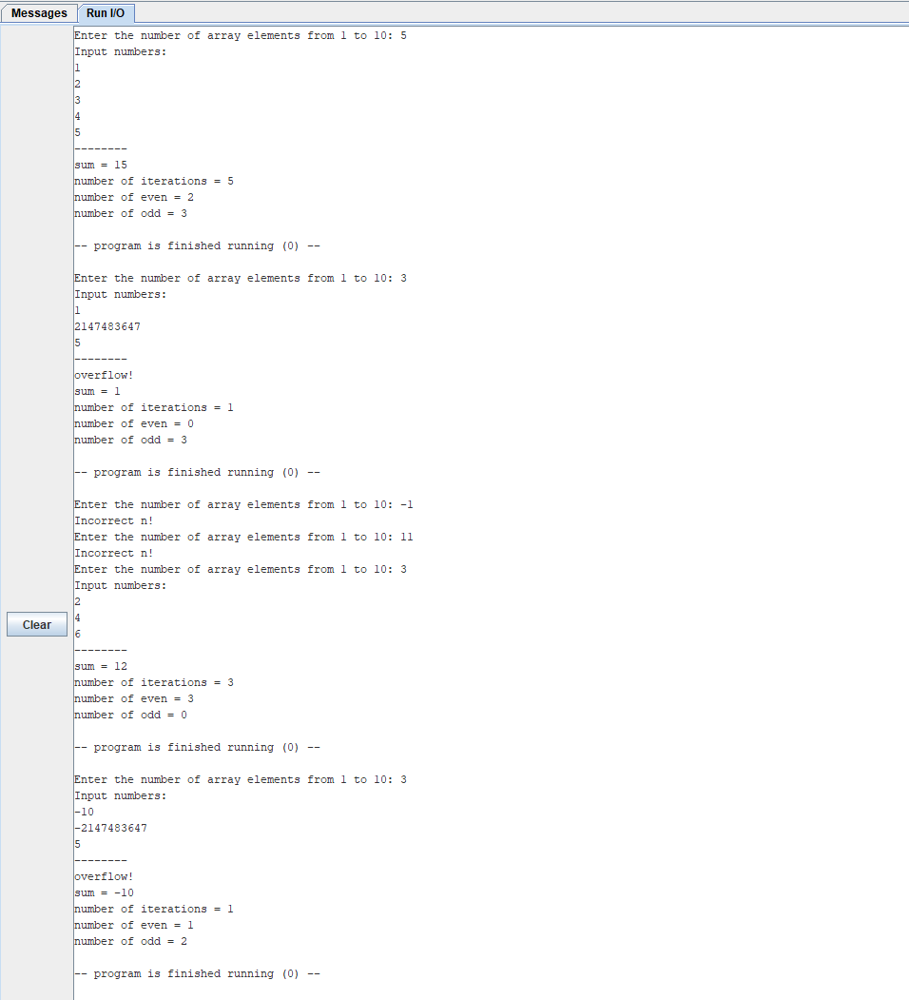

# Евсюков Александр БПИ224 <br/> Домашняя работа №5

### _Пример работы:_ 


### _Код программы:_ 

#### Main: 
```
.include "macrolib.s"
.include "input_arr.s"
.include "find_sum.s"

.global main

.text
main:
        print_str ("Enter the number of array elements from 1 to 10: ")
        read_int(t3)
        check_n         # Проверка корректности введенного n

        print_str ("Input numbers: ")
        newline
        input_arr       # Ввод массива
        
        solve
        
        output          # Вывод результата
        newline
        
        exit            # Завершение программы
```
#### Macrolib:
```
# Печать содержимого регистра как целого
.macro print_int (%x)
        li      a7, 1
        mv      a0, %x
        ecall
.end_macro

# Ввод целого числа с консоли в регистр a0
.macro read_int_a0
        li       a7, 5
        ecall
.end_macro

# Ввод целого числа с консоли в указанный регистр, исключая регистр a0
.macro read_int(%x)
        push     (a0)
        li       a7, 5
        ecall
        mv       %x, a0
        pop      (a0)
.end_macro

# Вывод строки 
.macro print_str (%x)
   .data
str:
        .asciz   %x
   .text
        push     (a0)
        li       a7, 4
        la       a0, str
        ecall
        pop      (a0)
.end_macro

# Вывод символа
.macro print_char(%x)
        li       a7, 11
        li       a0, %x
        ecall
.end_macro

# Новая строка
.macro newline
        print_char('\n')
.end_macro

# Сохранение заданного регистра на стеке
.macro push(%x)
        addi    sp, sp, -4
        sw      %x, (sp)
.end_macro

# Выталкивание значения с вершины стека в регистр
.macro pop(%x)
        lw      %x, (sp)
        addi    sp, sp, 4
.end_macro

# Проверка вводимого числа n
.macro check_n
        blez    t3, error_n         # if t3 < 0, сообщение об ошибке и повторный запрос N
        li      t6 10               # Сохранение 10 в t6
        bgt     t3, t6 error_n      # if t3 > 10, сообщение об ошибке и повторный запрос N
        li      t6 0                # Очистка 10 в t6
        la      t4 n                # Адрес n в t4
        sw      t3 (t4)             # Загрузка n в память на хранение
        j       exit
error_n:
        print_str("Incorrect n!")
        newline
        li      t6 0                # Очистка 10 в t6
        j       main
    exit:
.end_macro

# Вывоз подпрограммы, которая читаем вводимый массив
.macro input_arr
        jal     input_arr	
.end_macro

# Вызов подпрограммы, которая ищем сумму, число итераций, четные и нечетные элементы
.macro solve
        jal     find_sum
.end_macro

# Вызов подпрограммы, которая выводит результат
.macro output
        jal       output
.end_macro

# Завершение программы
.macro exit
        li      a7, 10
        ecall
.end_macro
```

#### input_arr и find_sum:
Подпрограммы, который должны считать и сохранить введенный массив и найти сумму элементов массива, включая прочие данные 