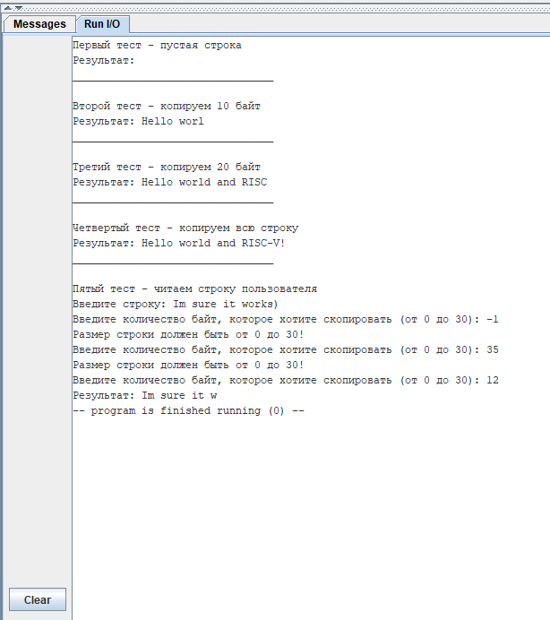

# Евсюков Александр БПИ224 <br/> Домашняя работа №6

## _Условие:_
Написать подпрограмму, осуществляющую копирование строки символов аналогично функции strncpy языка программирования C. Протестировать функцию на различных комбинациях данных. Ознакомиться с функцией можно в системе справки по библиотеке языка C, которая имеется в различных источниках информации. Исходные данные для тестирования задавать как при вводе с консоли, так и с использованием строк символов в разрабатываемой программе (по аналогии с программами, рассмотренными на семинаре). Подпрограмму вынести в отдельный файл.

Опционально до +2 баллов

Дополнительно к подпрограмме разработать соответствующий макрос, расширив тем самым макробиблиотеку строк символов.

## _Решение:_
Для решения задания была реализована подпрограмма `strncpy.s`, которая работает аналогично функции в языке С, а также добавлен соответствующий макрос в `macrolib`. Данная подпрограмма принимает на вход `str2, st1 и size`:
- str1 - исходная строка, которая может задаваться пользователем.
- str2 - строка, в которую копируется содержимое строки str1
- size - количество символов, которое копируется из str1 в str2.

Программа работает по следующему принципу: <br>
1. Если длина str1 = size, то копируются все символы
2. Если длина str1 > size, то копируем пока size > 0 и ставим нулевой символ в конец полученной строки
3. Если длина str1 < size, то копируем всю строку, а далее, пока size > 0, заполняем str2 нулевыми символами.

Помимо подпрограммы в `main.s` реализовано тестовое покрытие, а исходные данные для него задаются с использованием строк символов и ввода с консоли. Макробиблиотека расширена и теперь способна выводить строки получая на вход адрес, читать пользовательский размер буфера и проверять его на корректность, а также вызывать подпрограмму `strncpy`.

## _Код подпрограммы `strncpy.s`:_
```
.global strncpy

strncpy:
.text
	mv	t0 a1		# Адрес строки, в которую копируем 
	mv	t1 a2		# Адрес исходной строки
	lw	t2 (a3)	    	# Количество символов, которое надо скопировать

copy_loop:
	beqz 	t2 end_copy         # Если длина равно 0, то завершаем программу

	lb 	    t3 0(t1)        # Загружаем символ
	beqz	t3 end_copy	    # Если мы достигли конца исходной строки
	sb 	    t3 0(t0)        # Сохраняем символ

	addi 	t0 t0 1    	    # Переходим к следующему символу
	addi 	t1 t1 1    	    # Переходим к следующему символу
	addi	t2 t2 -1   	    # Уменьшаем длину
	
	j	    copy_loop	    # Повторяем цикл
	j	    exit	    # Выходим
	
end_copy:
	sb	    zero (t0)	    # Записываем нул-символ
	addi	t2 t2 -1   	    # Уменьшаем длину
	bgtz	t2 end_copy	    # Если длина больше 0, повторяем
	
exit:	
	li	    t0 0	# Очищаем регистр
	li	    t1 0	# Очищаем регистр
	li	    t2 0	# Очищаем регистр
	ret             	# Выход
```

## _Код `main.s`:_
```
.include "macrolib.s"

.global main

main:
.eqv	SIZE 30	    # Буфер

.data	
	.align 2							# Выравнивание ячеек
	test1_empty_str:	.asciz  ""			        # Тест 1, пустая строка
	test2_str:		.asciz  "Hello world and RISC-V!"	# Тест 2, строка
	test3_user_str:		.space  SIZE				# Тест 3, пользовательская строка
	user_size:		.word  0				# Длина строки от пользователя 	
	TEST1_SIZE_10:	    	.word  10				# Буфер на 10 байт
	TEST2_SIZE_20:	    	.word  20				# Буфер на 20 байт
	TEST3_SIZE_30:	    	.word  30				# Буфер на 30 байт
	result1:		.space SIZE				# Ответ1
	result2:		.space SIZE				# Ответ2
	result3:		.space SIZE				# Ответ3
	result4:		.space SIZE				# Ответ4
	result5:		.space SIZE				# Ответ5

.text
	print_str("Первый тест - пустая строка\n")
	strncpy(result1, test1_empty_str, TEST3_SIZE_30)
	print_str("Результат: ")
	print_string(result1)
	
	print_str("\n________________________________\n")
	newline
	
	print_str("Второй тест - копируем 10 байт\n")
	strncpy(result2, test2_str, TEST1_SIZE_10)
	print_str("Результат: ")
	print_string(result2)
	
	print_str("\n________________________________\n")
	newline
	
	print_str("Третий тест - копируем 20 байт\n")
	strncpy(result3, test2_str, TEST2_SIZE_20)
	print_str("Результат: ")
	print_string(result3)
	
	print_str("\n________________________________\n")
	newline
	
	print_str("Четвертый тест - копируем всю строку\n")
	strncpy(result4, test2_str, TEST3_SIZE_30)
	print_str("Результат: ")
	print_string(result4)
	
	print_str("\n________________________________\n")
	newline
	
	print_str("Пятый тест - читаем строку пользователя\n")
	print_str("Введите строку: ")
	read_str(test3_user_str, SIZE)
error:	print_str("Введите количество байт, которое хотите скопировать (от 0 до 30): ")
	read_size(user_size)
	check_size(user_size, SIZE)
	strncpy(result5, test3_user_str, user_size)
	print_str("Результат: ")
	print_string(result5)
	
	exit
```

## _Результат работы программы:_

