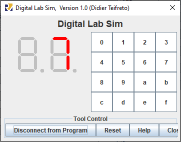
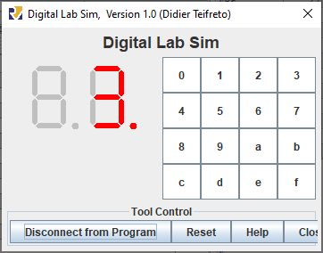
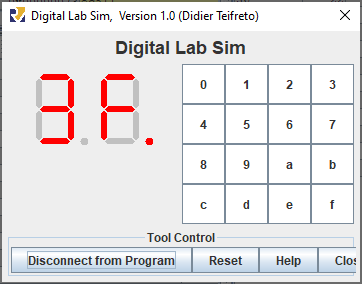
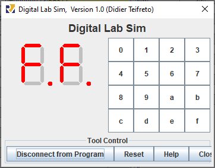

# Евсюков Александр БПИ224 <br/> Домашняя работа №7

## _Условие:_
Разработать подпрограмму, которая выводит на индикатор  цифрового блока цифру, передаваему через регистр a0. Адрес (левого или правого) индикатора задается в регистре a1. Если число в регистре a0 превышает шестнадцатиричную цифру, то учесть только младшие 4 разряда и выводить дополнительно точку. Для демонстрации написать программу, вызывающую эту подпрограмму, которая в цикле с задержкой (системный вызов sleep), каждую секунду выводит по циклу очередное значение в начале на один, а затем на другой индикатор.

Опционально до +2 баллов

Модифицировать программу для работы с клавиатурой, рассмотренной на семинаре таким образом, чтобы она, используя написанную подпрограмму, при нажатии соответствующей клавиши выводила на цифровой индикатор нажатую цифру. При отсутствии нажатой клавиши на цифровом индикаторе отобразить только точку.

## _Решение:_
Для решения был реализован цикл `auto_loop`, который с помощью `ret` обращался к блоку с числами. За счет того, что на каждой итерации `ra` увеличивался на `8`, можно было переходить от `0 до F`, а после перенести точку возврата обратно к `0`. В самом цикле был счетчик итераций и границы, которые указывали в какой индикатор записывать число. Для записи точки тоже использовалась система границ, а также к исходному числу добавлялось `128` в десятичной системе (`0х80` в шестнадцатеричной), так как в двоичной записи это число меняет только один нужный нам элемент. 

## _Код подпрограммы:_
```
.include "macro-syscalls.m"

main:
	lui	a2, 0xffff0	# MMIO address high half
	
	li	t1 1		# Число итераций
    li	t2 16		# Первая граница
    li	t3 32		# Вторая граница
    li	t4 48		# Третья граница
    li	t5 64		# Последняя граница
	
    j	make_loop	# Создание цикла через адрес возврата 
    	
pre_step:    	
    mv	s1 ra		# Сохраняем адрес начала цикла чисел
	ret			    # Первый вызов числа

auto_loop:
	ble 	t1, t3, first_display	 # if t1 <= 32 
	ble 	t1, t5, second_display	 # if t1 <= 64 
	bgt 	t1, t5, exit 			 # if t1 > 64
	
	first_display:
		ble 	t1, t2, first_less	# if t1 <= 16
		addi 	a0, a0, 0x80		# Делаем + 128 в 10чной системе, чтобы поставить точку		
		first_less:
		sb	a0, 0x10(a2)   	# (0xffff0000+0x10) правый индикатор	
		push(ra)			# Сохраняем путь, чтобы не потерять
		push(a0)			# Сохраняем a0
		sleep(300)			# ~Секунда задержки c учетом скорости 30 inst/sec
		pop(a0)
		pop(ra)
		addi	ra ra 8	    # Опускаем точку возврата на две инструкции, чтобы перейти к следующему числу
		addi	t1 t1 1	    # Увеличиваем счетчик на 1		
		ret			        # Возвращаемся к блоку с числами, но уже будем на следующем
		
	second_display:
		ble 	t1, t4, second_less	# if t1 <= 48
		addi 	a0, a0, 0x80		# Делаем + 128 в 10чной системе, чтобы поставить точку
		second_less:
		sb	a0, 0x11(a2)	# (0xffff0000+0x10) левый индикатор	
		push(ra)			# Сохраняем путь, чтобы не потерять
		push(a0)			# Сохраняем a0
		sleep(300)			# ~Секунда задержки c учетом скорости 30 inst/sec
		pop(a0)
		pop(ra)
		addi	ra ra 8	    # Опускаем точку возврата на две инструкции, чтобы перейти к следующему числу
		addi	t1 t1 1	    # Увеличиваем счетчик на 1
		ret			        # Возвращаемся к блоку с числами, но уже будем на следующем		
exit:		
	exit		# Выход


make_loop:	# Создаем точку возврата на первом числе
	jal	pre_step
null:
	li 	a0, 0x3f	#0
	j	auto_loop
one:
	li	a0, 0x6	#1
	j 	auto_loop
two:
	li 	a0, 0x5b	#2
	j	auto_loop
three:
	li 	a0, 0x4f	#3
	j	auto_loop
four:
	li 	a0, 0x66	#4
	j	auto_loop
five:
	li 	a0, 0x6d	#5
	j 	auto_loop
six:
	li 	a0, 0x7d	#6
    j	auto_loop
seven:
    li 	a0, 0x7	#7
    j 	auto_loop
eight:
    li 	a0, 0x7f	#8
    j 	auto_loop
nine:
    li	a0, 0x6f	#9
    j 	auto_loop
ten:	
	li	a0, 0x77	#10
    j 	auto_loop    	
eleven:	
	li	a0, 0x7c	#11
    j 	auto_loop 
twelve:	
	li	a0, 0x39	#12
    j 	auto_loop 
thirteen:	
	li	a0, 0x5e	#13
    j 	auto_loop 
fourteen:		
	li	a0, 0x79	#14
    j 	auto_loop
fifteen:   	
	li	a0, 0x71	#15
	mv	    ra s1		# Передаем в ra точку в начале числового блока
	addi	ra ra -8	# В цикле регистр будет увеличен, поэтому надо здесь его уменьшить
    j 	auto_loop
```
## _Результат работы программы:_



