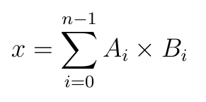
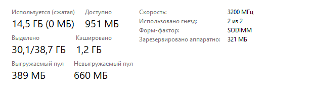
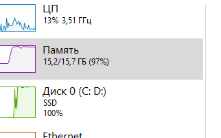
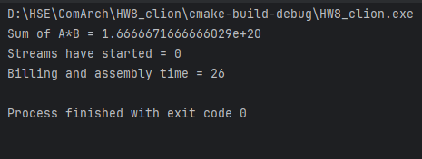

# Евсюков Александр БПИ224 <br/> Домашняя работа №8

## _Условие:_
Разработать многопоточную программу, вычисляющую векторное произведение
по формуле:



для двух векторов одинаковой длины. Каждый вектор содержит не менее 10000000 чисел с плавающей точкой двойной точности (double). Для выполнение программы использовать не менее четырех потоков. Зафиксировать время выполнения программы и сравнить его с временем выполнения той же программы в однопоточном режиме. Сформировать таблицу17.1, отображающую следующие результаты:

| Число элементов в векторе 	| Число потоков 	| Время выполнения 	|
|---------------------------	|---------------	|------------------	|
| 10000000                  	| 1             	| ???              	|
| 10000000                  	| 4             	| ???              	|

Генерацию векторов осуществить следующим образом:
* элементы вектора A порождать путем по формуле: Ai = i + 1;
* для получения элементов вектора B использовать формулу Bi = n − i.

Значение n задает число элементов в векторе. 

Программы можно писать как на C, так и на C++. Однако при этом необходимо использовать только функции библиотеки pthread. Библиотеку классов thread или другие библиотеки потоков (такие тоже существуют) не использовать!

_Опционально до +2 баллов_

Помимо двух вариантов расчетов с одним набором данных и двумя альтернативами потоков рассмотреть варианты, когда число потоков равно (включая базовые): 1, 2, 4, 8, 1000. При этом рассмотреть наборы данных размером: 500000000; 100000000000. Если свопинг возникает раньше, то определить, при каком числе элементов в массиве он возникает. 

Описать ситуации, когда происходит использование памяти подкачки (свопинг) и резко замедляются вычисления (если происходит).

## _Решение:_
Для решения задания за основу был взят семинарский пример `03-pthread01b`, который был дополнен, чтобы выполнять поставленное задание.

После проведения тестовых запусков на разных входных данных и с разным количеством потоков был получен следующий результат:

| Число элементов в векторе 	| Число потоков 	| Время выполнения 	|
|---------------------------	|---------------	|------------------	|
| 10000000                  	| 1             	| 25               	|
| 10000000                  	| 2             	| 28              	|
| 10000000                  	| 4             	| 36               	|
| 10000000                  	| 8             	| 37               	|
| 10000000                  	| 1000          	| 88               	|
| 100000000                  	| 1             	| 251              	|
| 100000000                  	| 2             	| 272              	|
| 100000000                  	| 4             	| 369              	|
| 100000000                  	| 8             	| 441              	|
| 100000000                  	| 1000          	| 843              	|
| 500000000                  	| 1             	| 1276            	|
| 500000000                  	| 2             	| 1502            	|
| 500000000                  	| 4             	| 1781           	|
| 500000000                  	| 8             	| 2306             	|
| 500000000                 	| 1000          	| 5962             	|
| 100000000000                 	| 1             	| 64273            	|
| 100000000000                 	| 2             	| 51355            	|
| 100000000000                 	| 4             	| 26630            	|
| 100000000000                 	| 8             	| 33861            	|
| 100000000000                 	| 1000          	| 44574            	|

Исходя из результатов тестов и согласно наблюдениям можно заметить, что свопинг(подкачка) возникает при любом числе потоков, когда число элементов в векторе равно 100000000000. Почти сразу после запуска программы мы наблюдаем, что система начинает использовать всю оперативную память компьютера, а также к работе подключается ssd диск. Помимо этого, можно заметить, что система увеличивает количество выделенной памяти. При более низком числе элементов в векторе ssd диск вообще не задействуется системой, а оперативная память полностью не нагружается. 



## _Код подпрограммы:_
``` cpp
#include <iostream>
#include <iomanip>
#include <limits>
#include <ctime>
#include <pthread.h>

struct Package {
    double* arrayA;  // Указатель на начало области обработки A
    double* arrayB;  // Указатель на начало области обработки B
    int threadNum;   // Номер потока
    double sum;      // Формируемая частичная сумма
} ;

const unsigned int arrSize = 10000000;
//const unsigned int arrSize = 100000000;
//const unsigned int arrSize = 500000000;
//const unsigned int arrSize = 100000000000;

double *A ;  //последовательность чисел a0...
double *B ;  //последовательность чисел b0...

const int threadNumber = 1;       // Количество потоков
//const int threadNumber = 2;     // Количество потоков
//const int threadNumber = 4;     // Количество потоков
//const int threadNumber = 8;     // Количество потоков
//const int threadNumber = 1000;  // Количество потоков

// Cтартовая функция для дочерних потоков
void *func(void *param) {    //вычисление суммы A[i]*B[i] в потоке
    // Востановление структуры
    Package* p = (Package*)param;
    p->sum = 0.0;
    for(unsigned int i = p->threadNum ; i < arrSize - 1; i+=threadNumber) {
        p->sum += p->arrayA[i] * p->arrayB[i]; // A[i]*B[i]
    }
    return nullptr;
}

int main() {
    double rez = 0.0 ; // Для записи окончательного результата

    // заполнение массива A
    A = new double[arrSize];
    if(A == nullptr) {
        std::cout << "Incorrect size of vector = A " << arrSize << "\n";
        return 1;
    }
    for(int i = 0; i < arrSize; ++i) {
        A[i] = double(i + 1);
    }
    
    // заполнение массива B
    B = new double[arrSize];
    if(B == nullptr) {
        std::cout << "Incorrect size of vector B = " << arrSize << "\n";
        return 1;
    }
    for(int i = 0; i < arrSize; ++i) {
        B[i] = double(arrSize - i);
    }

    pthread_t thread[threadNumber];
    Package pack[threadNumber];

    clock_t start_time =  clock(); // начальное время

    //создание дочерних потоков
    for (int i=0 ; i<threadNumber ; i++) {
        // Формирование структуры для передачи потоку
        pack[i].arrayA = A;
        pack[i].arrayB = B; // добавляем B

        pack[i].threadNum = i;
        pthread_create(&thread[i], nullptr, func, (void*)&pack[i]) ;
    }

    clock_t thread_started_time = clock(); // конечное время

    for (int i = 0 ; i < threadNumber; i++) {    // ожидание завершения работы дочерних потоков
        pthread_join(thread[i], nullptr) ;       // и получение результата их вычислений
        rez += pack[i].sum;
    }

    clock_t end_time = clock(); // конечное время

    //вывод результата
    std::cout << "Sum of A*B = " << std::scientific <<
        std::setprecision(std::numeric_limits<double>::digits10 + 1) << rez << "\n" ;

    std::cout << "Streams have started = " << thread_started_time - start_time << "\n";
    std::cout << "Billing and assembly time = " << end_time - start_time << "\n";

    delete[] A;
    delete[] B;
    return 0;
}
```
## _Результат работы программы:_

